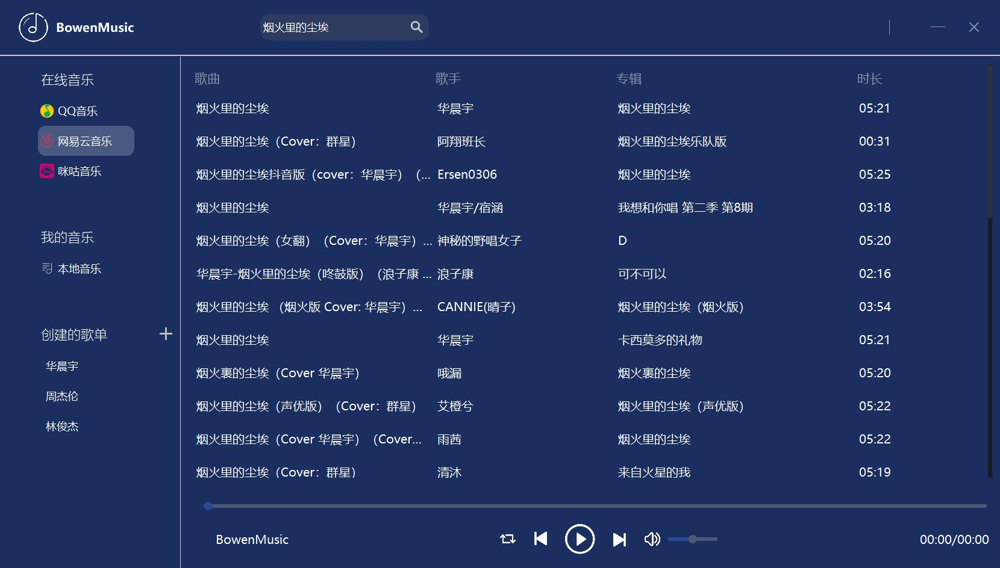
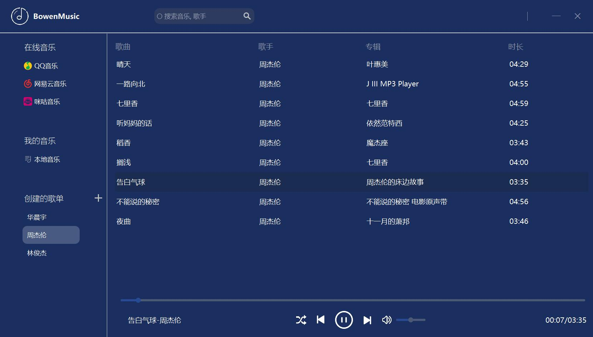

# BowenMusic
**Project for IS305**: 支持qq音乐、网易云、咪咕的音乐播放器。桌面版基于`PyQt5`，命令行版基于标准库`Cmd`.

### Structure
```
|-- qss                    .qss file for the style of GUI
|-- resource               icons
|-- src                    codes
|---- api.py               APIs of qq/neteasecloud/migu music
|---- component.py         Widgets inherit from `QLabel` and `QLineEdit`
|---- module.py            Four main modules: Header, Navigation, Mainlist, PlayWidgets
|---- MusicDesktop.py      Run code for desktop version.
|---- webdriver.py         Get qq music cookies using Selenium
|---- cmd_version
|------  intro.txt         intro
|------  MusicCmd.py       run code for command version
|-- userdata               cookie, download music and playlist created by the user
```
### Use
Requirements: `$ pip install -r requirements.txt`

Desktop version: `$ python ./src/MusicDesktop.py`

Command version: `$ python ./src/cmd_version/MusicCmd.py`

### API
[NeteaseCloudMusic API](https://github.com/Bowenduan/BowenMusic/wiki/NeteaseCloudMusic-API)

### Screenshot
##### 搜索歌曲

##### 歌单

##### Command
```
$ python ./src/cmd_version/MusicCmd.py
 ____                          __  __           _
| __ )  _____      _____ _ __ |  \/  |_   _ ___(_) ___
|  _ \ / _ \ \ /\ / / _ \ '_ \| |\/| | | | / __| |/ __|
| |_) | (_) \ V  V /  __/ | | | |  | | |_| \__ \ | (__
|____/ \___/ \_/\_/ \___|_| |_|_|  |_|\__,_|___/_|\___|
BowenMusic> pl
1. 华晨宇   
2. 周杰伦   
3. 林俊杰   
BowenMusic> search 晴天
    歌曲                          歌手                专辑                          时长      
---------------------------------------------------------------------------------------------
1.  晴天                          周杰伦              叶惠美                        04:29
2.  晴天（女声翻唱）               刘瑞琦                                            00:00     
3.  晴天 (Live)                   周杰伦              周杰伦地表最强世界巡回演唱会    04:09
4.  晴天 (Cover：周杰伦)           西瓜Kune            eonian day                   04:26
5.  晴天 (Live)                   娄艺潇              跨界歌王第二季 第9期           04:16
6.  欧阳耀莹 翻唱 晴天（周杰伦）    欧阳耀莹             欧阳耀莹 Cover合辑            02:27     
7.  晴天 (Live)                   林俊杰/周杰伦                                     03:59
8.  晴天 (Cover: 周杰伦)           符嘉超              只录一遍的倔强                 05:16
9.  晴天 (Cover: 周杰伦)           Vaniah维            Vaniah音乐实验室              04:31
10. 晴天 (Cover:  周杰伦)          哎呦哥哥            哎呦哥哥嗨你好                 04:44
----------------------------------------------------------------------------------------------
BowenMusic> s
Current source is 'qq'
BowenMusic> cs migu
Source is changed to migu music.
BowenMusic> play -s 1
BowenMusic> i
Playing 晴天 - 周杰伦  00:01/04:29
BowenMusic> m
pause.
BowenMusic> m
continue
BowenMusic> quit
Wish you good luck.
```
### Progress
2020.3.10 - 2020.3.15
* QQ Music API 调研已完成，可获取歌信息和URL，会员歌曲需要绿钻用户Cookie
* 图标准备，资源为[Iconfont](https://www.iconfont.cn/) 和 [easyicon](https://www.easyicon.net/)
* 基本界面的完成，包括Header, Navigation, Mainlist, Player 四个模块

2020.3.19
* 完成**global**音乐的双击下载与播放功能
* 问题
  * Album图片的显示不完整，更改了图片源后显示依然不变

2020.3.20
* 完成Navigation事件绑定，包括我的歌单，在线音乐，本地音乐
* 增加了将在线音乐添加到我的歌单的功能
* 问题
  * ~~Player排本问题（有的歌名特别长，把其他按钮挤到了最右边)~~
  * 最好设计成QQ音乐一样的滚动歌名（对于长歌名）

2020.3.21 
* 完成Player播放时间和滚动条的对应
* 调整Navigation栏目的间距和宽度（界面美化）
* 支持了多个歌单的“加入歌单”功能以及Navigation中多歌单的显示
* 完成歌单播放，对于本地音乐和歌单，播放里面的一首歌就将本地或对应歌单的所有歌加入后台播放列表中，并完成顺序、单曲循环、随机播放三种模式的功能

2020.3.23
* 完成网易云搜索歌曲（专辑、歌手）API，完成[网易云API文档](https://github.com/Bowenduan/BowenMusic/wiki/NeteaseCloudMusic-API)
* 问题
  ```python 
  from Crypto.Cipher import AES
  ```
  报错的原因是Crypto只支持32位，需要安装[pycryptodome](https://github.com/Legrandin/pycryptodome)，建议使用`pip install pycryptodomex`安装，然后
  ```python
  from Cryptodome.Cipher import AES
  ```

2020.3.24
* 将选择音乐源放在Navigation栏的在线音乐中
* 添加网易云搜索、播放、加入歌单功能
* 完成**咪咕音乐API**
* 添加咪咕搜索、播放、加入歌单功能

2020.3.25
* *webdriver.py* :使用selenium自动登录QQ音乐网页并获取cookie保存json文件，需在`self.account`和`self.password`中填入账号密码
```python 
class QQMusicWebdriver():
    def __init__(self):
        self.browser = webdriver.Chrome()
        self.browser.get('https://y.qq.com/')
        self.account = ''  # your qq id
        self.password = '' # your password
```
* QQMusicAPI中增加从本地json文件读取cookie
* 针对没有QQvip的cookie而无法下载歌曲的处理

2020.3.26
* 新建歌单功能

2020.3.27
* 删除、重命名歌单
* 新建歌单后的QLineEdit焦点设置

2020.3.28
* 本地音乐中增加播放、从本地删除功能
* 歌单中增加播放、从歌单删除功能
* 如果userdata/music中有其他奇怪的文件会报错的问题

2020.3.29 :musical_note: **Desktop version finished**
* Player部件排版调整，不会因为歌名长度不一而部件移动 
  * Question 如何在QLabel中实现滚动字幕 ?

2020.3.30
* cmd版: 展示歌单
  * `python-mpv` [安装](https://github.com/jaseg/python-mpv)
  * **mpv**播放器(windows) [安装](https://github.com/jaseg/python-mpv/issues/60#issuecomment-352719773)

2020.3.31
* cmd版: 搜索功能
  * 解决中英文混合输出对齐使用[wcwidth](https://github.com/jquast/wcwidth)

2020.4.4
* cmd版: 歌单创建/删除/重命名
* cmd版: 将搜索歌曲加入歌单功能
* cmd版: 更改源

2020.4.5
* cmd版: 播放歌单中的歌曲
```
BowenMusic> play        # default play from playlist 1
BowenMusic> play -pl 2  # play from playlist 2
BowenMusic> play -s 2   # play the 2nd song in the last search result
```

2020.4.6
* cmd版: 播放搜索的歌曲
* cmd版: 暂停/继续 

### TODO
* [x] 网易云音乐API
* [x] 咪咕音乐API
* [x] 添加歌单功能
* [x] Player排版问题（歌名长度不一致）
* [x] 从歌单中删除歌
* [ ] 歌曲信息以滚动的方式显示 **ScrollLabel** in */src/component.py*
* [ ] :triangular_flag_on_post: 添加命令行版本(Windows & Linux & MacOS) 使用强大的**mpv**播放器，以及`python-mpv`接口
