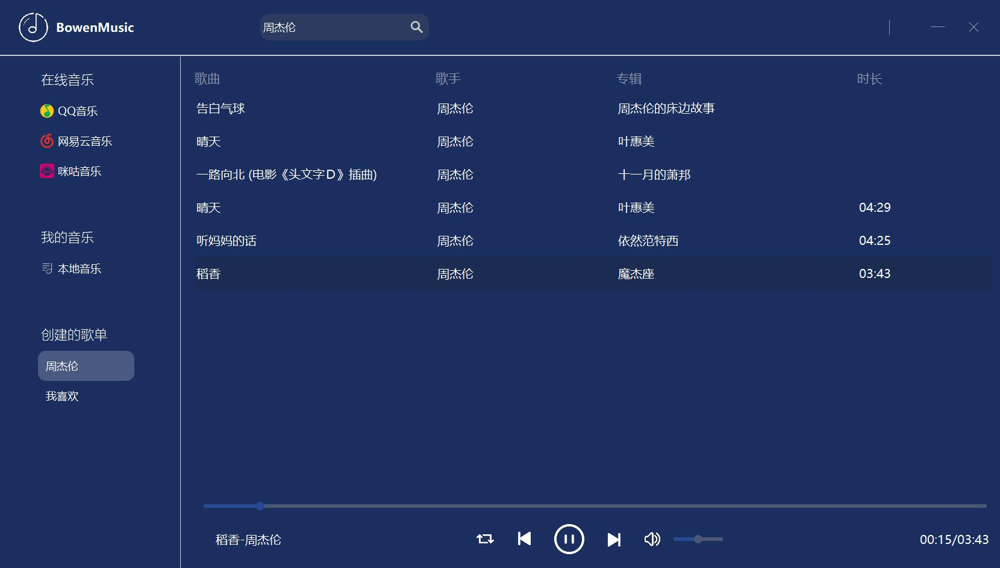

# BowenMusic
基于PyQt5的音乐播放器，目前只支持QQ音乐

### API
[NeteaseCloudMusic API](https://github.com/Bowenduan/BowenMusic/wiki/NeteaseCloudMusic-API)

### Screenshot

### Progress
2020.3.10 - 2020.3.15
* QQ Music API 调研已完成，可获取歌信息和URL，会员歌曲需要绿钻用户Cookie
* 图标准备，资源为[Iconfont](https://www.iconfont.cn/) 和 [easyicon](https://www.easyicon.net/)
* 基本界面的完成，包括Header, Navigation, Mainlist, Player 四个模块

2020.3.19
* 完成**global**音乐的双击下载与播放功能
* 问题
  * Album图片的显示不完整，更改了图片源后显示依然不变

2020.3.20
* 完成Navigation事件绑定，包括我的歌单，在线音乐，本地音乐
* 增加了将在线音乐添加到我的歌单的功能
* 问题
  * Player排本问题（有的歌名特别长，把其他按钮挤到了最右边)
  * 最好设计成QQ音乐一样的滚动歌名（对于长歌名）

2020.3.21 
* 完成Player播放时间和滚动条的对应
* 调整Navigation栏目的间距和宽度（界面美化）
* 支持了多个歌单的“加入歌单”功能以及Navigation中多歌单的显示
* 完成歌单播放，对于本地音乐和歌单，播放里面的一首歌就将本地或对应歌单的所有歌加入后台播放列表中，并完成顺序、单曲循环、随机播放三种模式的功能

2020.3.23
* 完成网易云搜索歌曲（专辑、歌手）API，完成[网易云API文档](https://github.com/Bowenduan/BowenMusic/wiki/NeteaseCloudMusic-API)
* 问题
  ```python 
  from Crypto.Cipher import AES
  ```
  报错的原因是Crypto只支持32位，需要安装[pycryptodome](https://github.com/Legrandin/pycryptodome)，建议使用`pip install pycryptodomex`安装，然后
  ```python
  from Cryptodome.Cipher import AES
  ```

2020.3.24
* 将选择音乐源放在Navigation栏的在线音乐中
* 添加网易云搜索、播放、加入歌单功能
* 完成咪咕音乐API
* 添加咪咕搜索、播放、加入歌单功能

2020.3.25
* *webdriver.py* :使用selenium自动登录QQ音乐网页并获取cookie保存json文件，需在`self.account`和`self.password`中填入账号密码
```python 
class QQMusicWebdriver():
    def __init__(self):
        self.browser = webdriver.Chrome()
        self.browser.get('https://y.qq.com/')
        self.account = ''  # your qq id
        self.password = '' # your password
```
* QQMusicAPI中增加从本地json文件读取cookie

### TODO
* [x] 网易云音乐API
* [x] 咪咕音乐API
* [ ] 添加歌单功能
* [ ] Player排版问题（歌名长度不一致）
* [ ] 从歌单中删除歌